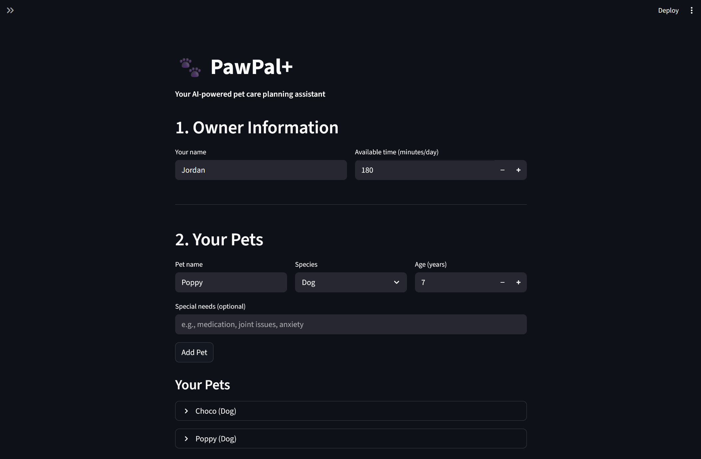
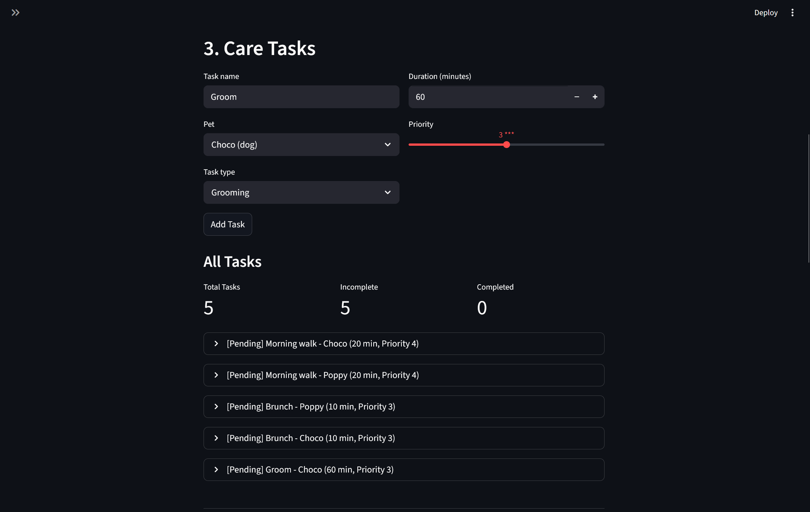
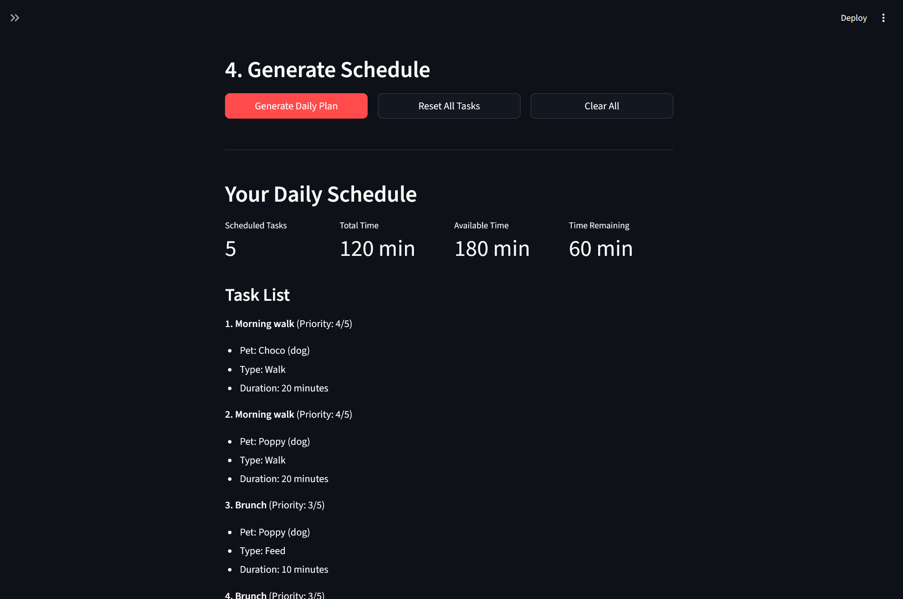
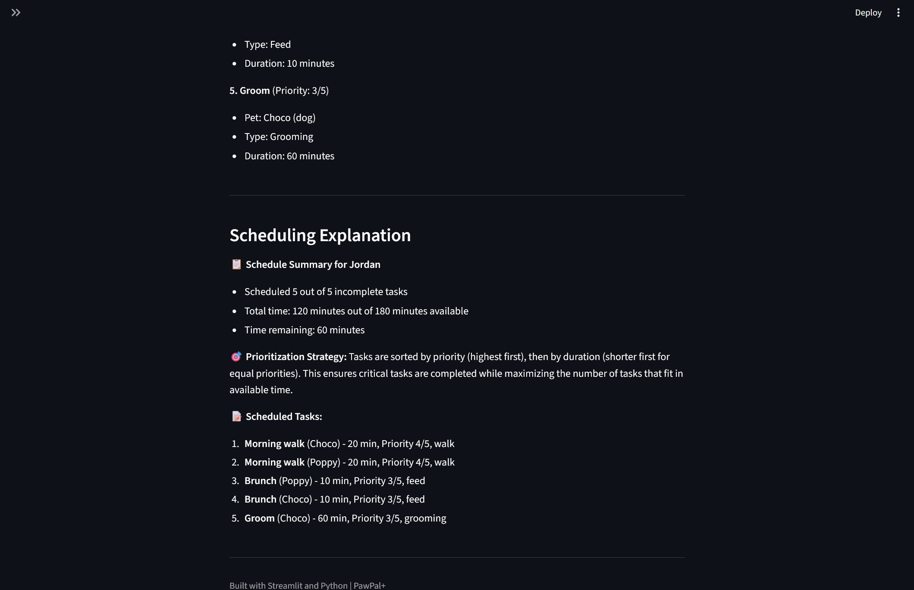
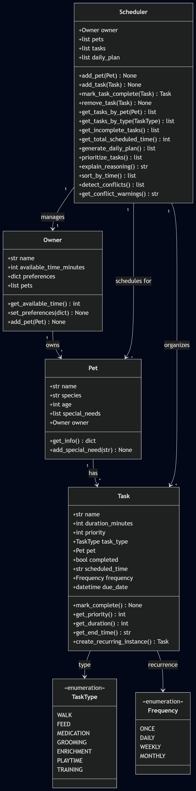

# PawPal+

A Streamlit app that helps pet owners plan and prioritize daily care tasks.

## Scenario

A busy pet owner needs help staying on top of pet care. PawPal+ lets them:

- Track care tasks (walks, feeding, meds, enrichment, grooming)
- Set time constraints and task priorities
- Generate a daily plan that fits within their available time
- See why the scheduler made the choices it did

## Features

- Add/manage multiple pets with special needs
- Create tasks with priority (1-5), duration, and task type
- Priority-based scheduling that fits tasks into available daily time
- Sorting tasks by scheduled time
- Filtering tasks by pet, type, or completion status
- Recurring task support (daily, weekly, monthly)
- Conflict detection for overlapping time slots
- Plain-language explanation of scheduling decisions

## Smarter scheduling

The scheduler uses a greedy algorithm: tasks are sorted by priority (highest first), with ties broken by duration (shortest first). It then packs tasks into the owner's available time until the budget runs out.

This means critical tasks like medication always get scheduled before optional ones. The duration tiebreaker helps fit more tasks in when priorities are equal.

The system also detects time conflicts (two tasks scheduled at the same time) and warns the user, and handles recurring tasks by auto-creating the next instance when you mark one complete.

## Getting started

```bash
python -m venv .venv
source .venv/bin/activate
pip install -r requirements.txt
```

Run the CLI demo:
```bash
python main.py
```

Run the Streamlit app:
```bash
streamlit run app.py
```

## Testing PawPal+

Run the test suite:
```bash
python -m pytest test_pawpal_system.py -v
```

The tests cover data model validation, scheduling logic, task filtering, time-based features (sorting, conflict detection), recurring tasks, and a full integration workflow.

**Confidence level: 4/5** -- All 41 tests pass and cover the main behaviors and edge cases. The remaining gap is stress testing with large task sets and concurrent UI interactions.

## Demo






## System architecture



See [uml_final.md](uml_final.md) for the Mermaid.js class diagram showing how Owner, Pet, Task, and Scheduler relate to each other.
