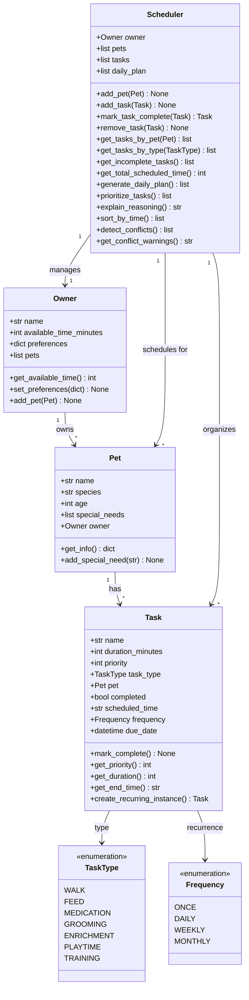

```mermaid
classDiagram
    class Owner {
        +str name
        +int available_time_minutes
        +dict preferences
        +list pets
        +get_available_time() int
        +set_preferences(dict) None
        +add_pet(Pet) None
    }

    class Pet {
        +str name
        +str species
        +int age
        +list special_needs
        +Owner owner
        +get_info() dict
        +add_special_need(str) None
    }

    class Task {
        +str name
        +int duration_minutes
        +int priority
        +TaskType task_type
        +Pet pet
        +bool completed
        +str scheduled_time
        +Frequency frequency
        +datetime due_date
        +mark_complete() None
        +get_priority() int
        +get_duration() int
        +get_end_time() str
        +create_recurring_instance() Task
    }

    class Scheduler {
        +Owner owner
        +list pets
        +list tasks
        +list daily_plan
        +add_pet(Pet) None
        +add_task(Task) None
        +mark_task_complete(Task) Task
        +remove_task(Task) None
        +get_tasks_by_pet(Pet) list
        +get_tasks_by_type(TaskType) list
        +get_incomplete_tasks() list
        +get_total_scheduled_time() int
        +generate_daily_plan() list
        +prioritize_tasks() list
        +explain_reasoning() str
        +sort_by_time() list
        +detect_conflicts() list
        +get_conflict_warnings() str
    }

    class TaskType {
        <<enumeration>>
        WALK
        FEED
        MEDICATION
        GROOMING
        ENRICHMENT
        PLAYTIME
        TRAINING
    }

    class Frequency {
        <<enumeration>>
        ONCE
        DAILY
        WEEKLY
        MONTHLY
    }

    Owner "1" --> "*" Pet : owns
    Pet "1" --> "*" Task : has
    Scheduler "1" --> "1" Owner : manages
    Scheduler "1" --> "*" Pet : schedules for
    Scheduler "1" --> "*" Task : organizes
    Task --> TaskType : type
    Task --> Frequency : recurrence
```
